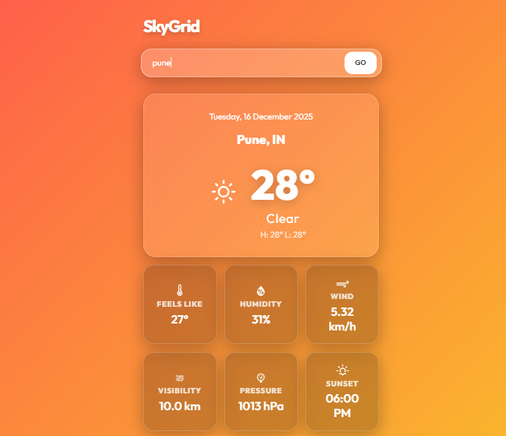

# 🌤️ SkyGrid - Modern Weather Dashboard

[](https://sky-grid.vercel.app/)


> A sleek, glassmorphism-styled weather application built with React and Vite. Features real-time data, dynamic backgrounds, and smooth framer-motion animations.

---

## 📸 Snapshot

  
*(Note: Add a screenshot of your app running here)*

---

## 🌟 Key Features

* **Real-Time Data**: Fetches live weather data from the OpenWeatherMap API.
* **Glassmorphism UI**: Modern, frosted-glass interface using CSS backdrop filters.
* **Dynamic Backgrounds**: Background changes automatically based on temperature (Warm vs. Cold).
* **5-Day Forecast**: Horizontal scrolling forecast using filtered API data.
* **Rich Details**: View Humidity, Wind Speed, Visibility, Pressure, and Sunset times.
* **Smooth Animations**: Powered by `framer-motion` for interactive UI elements.
* **Responsive**: Fully optimized for Desktop and Mobile viewing.

---

## 🛠️ Tech Stack

* **Frontend**: [React.js](https://reactjs.org/) (Hooks, Custom Hooks)
* **Build Tool**: [Vite](https://vitejs.dev/)
* **Styling**: CSS3 (Variables, Grid, Flexbox, Glassmorphism)
* **Animations**: [Framer Motion](https://www.framer.com/motion/)
* **Icons**: [React Icons](https://react-icons.github.io/react-icons/) (Weather Icons)
* **API**: [OpenWeatherMap](https://openweathermap.org/api)

---

## 🚀 Getting Started

Follow these steps to run the project locally.

### 1. Clone the repository
```bash
git clone https://github.com/tejashree-dumasia/SkyGrid.git
cd SkyGrid
```

### 2. Install dependencies

```bash
npm install
```

### 3. Configure API Key

Create a `.env` file in the root directory and add your OpenWeatherMap key:

```env
VITE_API_KEY=your_api_key_here
```

### 4. Run the App

```bash
npm run dev
```

Open `http://localhost:5173` to view it in the browser.

---

## 📂 Project Structure

```text
src/
├── components/       # Reusable UI components
│   ├── ForecastList.jsx
│   ├── SearchBox.jsx
│   └── WeatherCard.jsx
├── hooks/            # Custom React hooks
│   └── useWeather.js # API logic & state management
├── utils/            # Helper functions
│   └── dateBuilder.js
├── App.jsx           # Main application layout
└── App.css           # Global styles & Glassmorphism
```

---

## 🤝 Contact

**Tejashree Dumasia**
[GitHub Profile](https://github.com/tejashree-dumasia)

---

<p align="center">
Built with ❤️ using React
</p>

